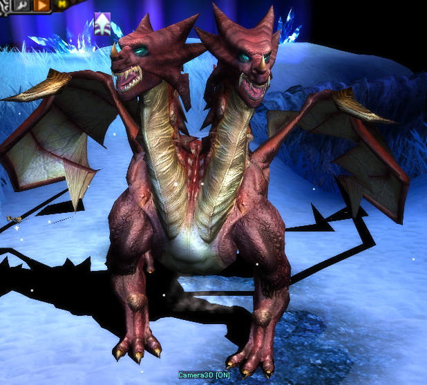

# ⚡ POTTEN

<figure><figcaption></figcaption></figure>

## 🌎 Ubicación del Boss

El <mark style="color:yellow;">**Boss Potten**</mark> aparecera exclusivamente en el <mark style="color:yellow;">**Map Devias**</mark> de forma aleatoria, tendras que buscarlo!


**CONSEJO:**

Aparecerá un mensaje global para todos los jugadores cuando aparezca **Potten.**


## 📦 Item Drop Potten.

Este boss dropea items de **Box of Kundun +3** and **Box of Kundun +4**.

| 🗂️ **Categoria**       | 🎁 **Items**                                                                                                                                                                                                                                                                                                                                                                                                                                                                                                                       |
| ----------------------- | ---------------------------------------------------------------------------------------------------------------------------------------------------------------------------------------------------------------------------------------------------------------------------------------------------------------------------------------------------------------------------------------------------------------------------------------------------------------------------------------------------------------------------------- |
| 👕 **Sets**             | 
<strong>Dragon Set</strong> <strong>Legendary Set</strong> <strong>Spirit Set</strong> <strong>Guardian Set</strong> <strong>Storm Crow Set</strong> <strong>Light Plate Set</strong> <strong>Red Wing Set</strong> <strong>Black Dragon Set</strong> <strong>Dark Phoenix Set</strong> <strong>Grand Soul Set</strong> <strong>Divine Set</strong> <strong>Thunder Hawk Set</strong> <strong>Admantine Set</strong> <strong>Dark Steel Set</strong> <strong>Ancient Set</strong>
 |
| 🛡️ **Shields**         | 
<strong>Plate Shield</strong> <strong>Large Round Shield</strong> <strong>Serpent Shield</strong> <strong>Bronze Shield</strong>
                                                                                                                                                                                                                                                                                                                                                                                   |
| ⚔️ **Swords**           | 
<strong>Double Blade</strong> <strong>Lighting Sword</strong> <strong>Giant Sword</strong> <strong>Sword of Destruction</strong> <strong>Dark Breaker</strong> <strong>Thunder Blade</strong> <strong>Rune Blade</strong>
                                                                                                                                                                                                                                                                                 |
| 🪓 **Axes**             | 
<strong>Nikkea Axe</strong> <strong>Larkan Axe</strong> <strong>Crescent Axe</strong>
                                                                                                                                                                                                                                                                                                                                                                                                                                 |
| 🔨 **Maces / Scepters** | 
<strong>Chaos Dragon Axe</strong> <strong>Elemental Mace</strong> <strong>Battle Scepter</strong> <strong>Master Scepter</strong> <strong>Great Lord</strong> <strong>Lord Scepter</strong>
                                                                                                                                                                                                                                                                                                                  |
| 🔱 **Scythes**          | 
<strong>Berdysh</strong> <strong>Great Scythe</strong> <strong>Bill of Balrog</strong>
                                                                                                                                                                                                                                                                                                                                                                                                                                |
| 🏹 **Bows**             | 
<strong>Chaos Nature Bow</strong> <strong>Saint Crosbow</strong> <strong>Celestial Bow</strong>
                                                                                                                                                                                                                                                                                                                                                                                                                       |
| 🎯 **Crossbows**        | 
<strong>Bluewing Crossbow</strong> <strong>Aquagold Crossbow</strong>
                                                                                                                                                                                                                                                                                                                                                                                                                                                    |
| 🔮 **Staffs / Books**   | 
<strong>Legendary Staff</strong> <strong>Gorgon Staff</strong> <strong>Staff of Resurrection</strong> <strong>Chaos Lightning Staff</strong> <strong>Staff of Destruction</strong> <strong>Red Wing Staff</strong> <strong>Grand Soul Staff</strong> <strong>Ancient Staff</strong> <strong>Book of Sahamutt</strong> <strong>Book of Neil</strong>
                                                                                                                                              |


El **Boss Potten** puede dropear los items con:

* ✅ 1 o **2 opciones EXE.**
* 🎯 Posibilidad de obtener **ítems Full Options (F.O.).**



**INFORMACIÓN:**

Para ver a que hora comienza la invasión, puedes ir a la seccion de **"**[**Horario Eventos/Invas**](../cronograma-eventos.md)**".**

